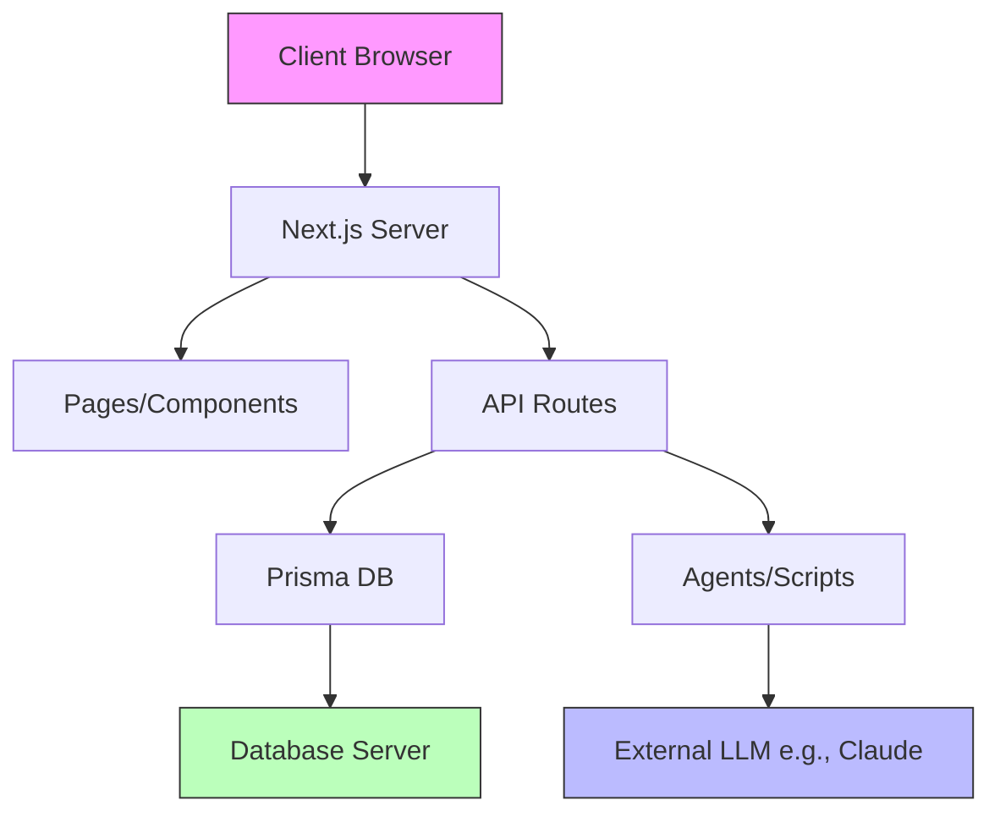

<!-- agent-update:start:architecture-notes -->
# Architecture Notes

The system is a full-stack web application built with Next.js, serving as a monolith for development and deployment efficiency. It integrates AI agent playbooks for documentation and workflow automation, with Prisma handling database operations. The design prioritizes rapid iteration, type safety via TypeScript, and maintainability through modular source structure, chosen to support an AI-assisted development scaffolding tool while keeping the footprint lightweight (42 MB, 268 files). This evolved from a basic Next.js setup to include agent orchestration and Prisma for data persistence, balancing simplicity with extensibility for migration planning tools (e.g., PLANO_MIGRACAO.md).

## System Architecture Overview
The application follows a monolithic topology, deployed as a single Next.js unit (server-side rendering, static generation, and API routes). It operates in a client-server model, typically hosted on Vercel or similar Node.js environments.

- **Request Flow**: Inbound HTTP requests hit Next.js pages or API routes in `src/app/` (App Router structure). Client-side rendering fetches data via React hooks or SWR. Server actions and API handlers pivot control to Prisma for database queries or to agent scripts for AI tasks. Responses traverse back through middleware (e.g., authentication, if implemented) to the client.
- **Deployment Model**: Built with `next build` for production, supporting serverless functions. CI/CD likely via GitHub Actions or similar, inferred from standard Next.js tooling.

## Core System Components
- **src/** (181 files): Core application logic, including React components, pages (`src/app/`), API routes (`src/app/api/`), utilities, and hooks. Organized modularly with folders for components, lib, and agents integration.
- **prisma/** (37 files): Database schema (`schema.prisma`), migrations, and seed scripts. Uses Prisma ORM for type-safe queries against a relational database (e.g., PostgreSQL).
- **agents/** (7 files): AI agent playbooks and instructions for tasks like documentation updates and scaffolding. Integrates with LLMs (e.g., Claude via `CLAUDE.md`).
- **docs/** (17 files): Markdown-based documentation, including architecture, migration plans (e.g., `PLANO_MIGRACAO.md`, `ACOMPANHAMENTO_MIGRACAO.md`), and guides.
- **tests/** (6 files): End-to-end tests using Playwright (`playwright.config.ts`), focusing on UI and API flows.
- **public/** (1 file): Static assets like images or favicons.
- **scripts/** (2 files): Build and utility scripts, possibly for database seeding or agent execution.
- **Configuration Files**: `package.json` (dependencies like Next.js, Prisma, TailwindCSS), `tsconfig.json` (TypeScript setup), `next.config.ts` (Next.js optimizations), `tailwind.config.ts` and `postcss.config.mjs` (styling), `eslint.config.mjs` (linting).

## Internal System Boundaries
- **Domains/Bounded Contexts**: 
  - Frontend (Next.js pages/components): Handles UI rendering and user interactions.
  - Backend (API routes + Prisma): Owns data access and business logic; enforces contracts via TypeScript interfaces.
  - Agents: Isolated orchestration layer for AI tasks, with seams via script invocation or API calls to avoid tight coupling.
- **Data Ownership**: Prisma centralizes database access; models define ownership (e.g., user data, migration tracking). Synchronization uses Prisma migrations for schema evolution; no complex event sourcing observed.
- **Shared Contracts**: TypeScript ensures API shapes; ESLint enforces code style across boundaries.

## System Integration Points
- **Inbound Interfaces**: 
  - RESTful API routes in `src/app/api/` for data CRUD and agent triggers.
  - Web UI via Next.js pages.
  - No explicit event streams or webhooks; potential for future via server-sent events.
- **Orchestration Touchpoints**: API routes coordinate with Prisma for DB ops and scripts/agents for AI workflows (e.g., updating docs). No inter-service calls in monolith; all internal.

## External Service Dependencies
- **Database**: Prisma connects to a relational DB (e.g., PostgreSQL on Supabase or AWS RDS). Authentication via Prisma's built-in support; rate limits handled by DB provider; failures mitigated with connection pooling and retries in Prisma client.
- **AI Services**: Integration with Anthropic Claude (per `CLAUDE.md`), using API keys for LLM calls in agents. Rate limits: Claude's tiered quotas (e.g., 100 RPM); auth via API tokens; failures handled with exponential backoff in agent scripts.
- **Styling/CDN**: TailwindCSS (local) and potential Vercel/Cloudflare for deployment; no heavy external APIs beyond these.
- **Testing**: Playwright may use browser binaries; no external deps noted.
- **General**: Node.js ecosystem (npm packages); monitor for deprecations in `package.json`.

## Key Decisions & Trade-offs
- **Next.js Monolith**: Chosen for unified full-stack development over separate frontend/backend (e.g., React + Express) to reduce deployment complexity and enable server components. Trade-off: Harder scaling than microservices, but suitable for <50k users.
- **Prisma ORM**: Selected for auto-generated types and migrations vs. raw SQL (e.g., Drizzle) for faster prototyping; trade-off: Abstraction overhead but gains in safety.
- **TypeScript + ESLint**: Enforced for maintainability; over raw JS to catch errors early in AI-assisted coding.
- **Agent Integration**: Custom playbooks in `agents/` for AI scaffolding, inspired by tools like LangChain; won over full frameworks to keep lightweight.
- **References**: See `docs/project-overview.md` for setup; `CHANGELOG.md` for evolution; no formal ADRs, but migration plans in `PLANO_MIGRACAO.md` outline shifts from legacy systems.

## Diagrams

This diagram illustrates the high-level flow: UI requests to Next.js, pivoting to DB or AI agents.

## Risks & Constraints
- **Performance**: Monolith may bottleneck at high concurrency; constrain to <10k concurrent users without sharding. Prisma queries need indexing for large datasets.
- **Scaling**: Vertical scaling preferred; horizontal via Next.js edge runtime. Database as single point of failure—recommend replication.
- **Dependencies**: AI rate limits could halt agent tasks; external outages (e.g., Claude API) block documentation updates—fallback to manual processes.
- **Security**: API exposure risks; assume JWT auth in routes. Constraints from migration context (e.g., legacy data sync in `ACOMPANHAMENTO_MIGRACAO.md`).
- **Technical Debt**: Evolving agent integration; monitor for TODOs in scripts. No active incidents noted, but test coverage (6 files) is low—expand E2E.

<!-- agent-readonly:guidance -->
## AI Update Checklist
1. Review ADRs, design docs, or major PRs for architectural changes.
2. Verify that each documented decision still holds; mark superseded choices clearly.
3. Capture upstream/downstream impacts (APIs, events, data flows).
4. Update Risks & Constraints with active incident learnings or TODO debt.
5. Link any new diagrams or dashboards referenced in recent work.

<!-- agent-readonly:sources -->
## Acceptable Sources
- ADR folders, `/docs/architecture` notes, or RFC threads.
- Dependency visualisations from build tooling or scripts.
- Issue tracker discussions vetted by maintainers.

## Related Resources
- [Project Overview](./project-overview.md)
- Update [agents/README.md](../agents/README.md) when architecture changes.

<!-- agent-update:end -->
