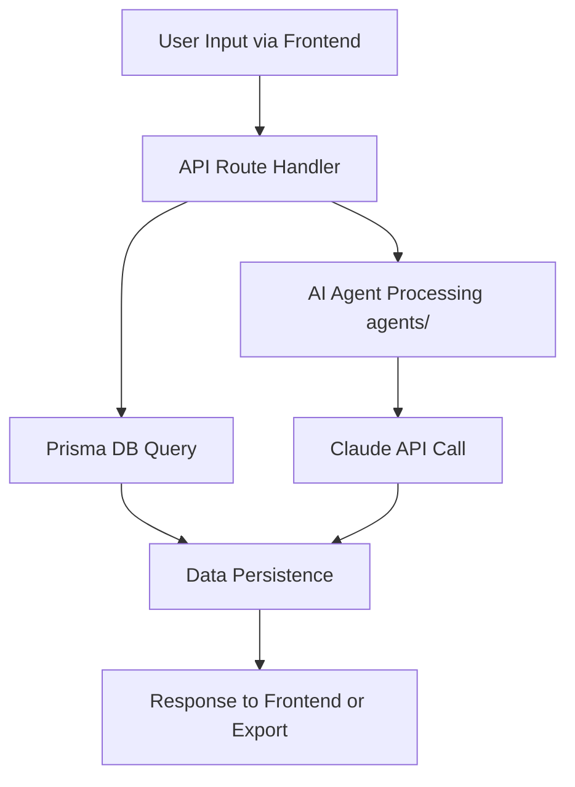

```markdown
---
ai_update_goal: Refresh the data flow documentation to reflect the current architecture of a Next.js application with Prisma ORM, AI agent integrations, and frontend-backend interactions. Ensure descriptions cover user inputs, API processing, database persistence, external API calls (e.g., Claude), and error handling.
required_inputs:
  - Repository structure (src/app for Next.js routes, prisma/schema.prisma for DB models)
  - Key files: CLAUDE.md for AI integration details, agents/ for playbook-based processing
  - Any diagrams: None embedded; reference Mermaid in README.md if available
success_criteria:
  - High-level flow diagram or summary accurately depicts input-to-output pipeline.
  - Internal collaborations describe HTTP requests, DB queries, and async calls without unresolved placeholders.
  - External integrations list at least one concrete example (Claude API) with purpose, auth, payloads, and retries.
  - Observability section includes logging, monitoring tools, and failure recovery strategies.
  - All agent-fill and TODO elements resolved; cross-links to related docs (e.g., agents/ playbooks) are valid.
---

<!-- agent-update:start:data-flow -->
# Data Flow & Integrations

Explain how data enters, moves through, and exits the system, including interactions with external services.

## High-level Flow

Data enters the system primarily through user interactions with the Next.js frontend (src/app/), such as form submissions or API-triggered events. The flow proceeds as follows:

1. **Input**: User submits data via React components in src/app/, which triggers API routes (e.g., src/app/api/[route]/route.ts).
2. **Processing**: API handlers validate input, interact with the Prisma ORM for database operations, and optionally invoke AI agents from the agents/ directory for intelligent processing (e.g., migration analysis).
3. **External Calls**: If needed, the system calls external services like the Claude API for AI inference.
4. **Persistence**: Processed data is stored in the PostgreSQL database via Prisma (prisma/schema.prisma).
5. **Output**: Responses are returned to the frontend for rendering, or data is exported via scripts/ for batch operations (e.g., migration reports).

For a visual overview, see the Mermaid diagram in [docs/architecture.md](architecture.md) (if available) or generate one using:



## Internal Movement

Modules collaborate via standard Next.js patterns: HTTP requests from frontend to API routes, direct Prisma client calls in server-side code, and modular imports for agents.

- **Frontend to Backend**: Client-side fetches (e.g., using fetch() or SWR) from src/app/ pages/components to API routes in src/app/api/. No explicit queues or RPC; synchronous HTTP for most interactions.
- **Backend Processing**: API routes import and use @prisma/client for database access (e.g., `prisma.user.create()`). AI logic pulls from agents/*.md playbooks, executing TypeScript functions in src/lib/ or src/agents/ to orchestrate tasks like data validation or migration simulations.
- **Database Layer**: All modules share the Prisma schema (prisma/schema.prisma), with migrations run via `npx prisma migrate deploy`. Shared state is managed via the DB; caching uses Next.js built-in (e.g., revalidatePath).
- **Scripts and Tests**: Batch jobs in scripts/ (e.g., data seeding) interact with Prisma directly. Tests in tests/ mock API flows and DB with Playwright or Jest, ensuring end-to-end data movement validation.
- **Event Handling**: Limited events via Next.js Server Actions or webhooks; no dedicated queue system like Redis observed.

Cross-reference: See [docs/agents.md](agents.md) for agent-specific workflows and [prisma/schema.prisma](prisma/schema.prisma) for entity relationships.

## External Integrations

- **Claude API (Anthropic)** — Used for AI-driven analysis in migration accompaniment (e.g., processing user queries or generating reports based on CLAUDE.md guidelines). Authentication via API key stored in environment variables (.env). Payload shapes are JSON objects with {model: string, messages: array, max_tokens: number}, following Anthropic's chat completions format. Retry strategy: Exponential backoff with a maximum of 3 attempts, using libraries like p-retry in API routes; rate limits handled by queuing requests if exceeding 100 RPM.

No other major external integrations observed; future additions (e.g., email services via Nodemailer) would follow similar patterns documented in ADRs.

## Observability & Failure Modes

- **Metrics and Traces**: Console logging in API routes for key events (e.g., `console.log('Processing migration data')`). Distributed tracing not implemented; recommend OpenTelemetry integration for future. Metrics via Next.js telemetry or custom counters in src/lib/metrics.ts (if added). Database queries logged via Prisma's query logging in development.
- **Logs**: All errors and flows captured in Vercel logs (deployment platform) or local console. Structured logging with JSON for production.
- **Failure Modes**:
  - **Downstream Failures**: If Claude API fails (e.g., 429 rate limit), implement retry with backoff (1s, 2s, 4s delays). Dead-letter queue simulated via fallback to cached responses or error notifications.
  - **DB Errors**: Prisma handles connection failures with retries; compensating actions include transaction rollbacks and user-facing error messages (e.g., "Migration analysis unavailable").
  - **Network/Timeout**: API routes use timeouts (e.g., 30s via AbortController); failures trigger 500 responses with Sentry integration (if enabled).

Monitoring dashboards: Use Vercel Analytics for traffic; for incidents, reference runbooks in [docs/runbooks.md](runbooks.md) (TBD).

<!-- agent-readonly:guidance -->
## AI Update Checklist
1. Validate flows against the latest integration contracts or diagrams.
2. Update authentication, scopes, or rate limits when they change.
3. Capture recent incidents or lessons learned that influenced reliability.
4. Link to runbooks or dashboards used during triage.

<!-- agent-readonly:sources -->
## Acceptable Sources
- Architecture diagrams, ADRs, integration playbooks.
- API specs, queue/topic definitions, infrastructure code.
- Postmortems or incident reviews impacting data movement.

<!-- agent-update:end -->
```
